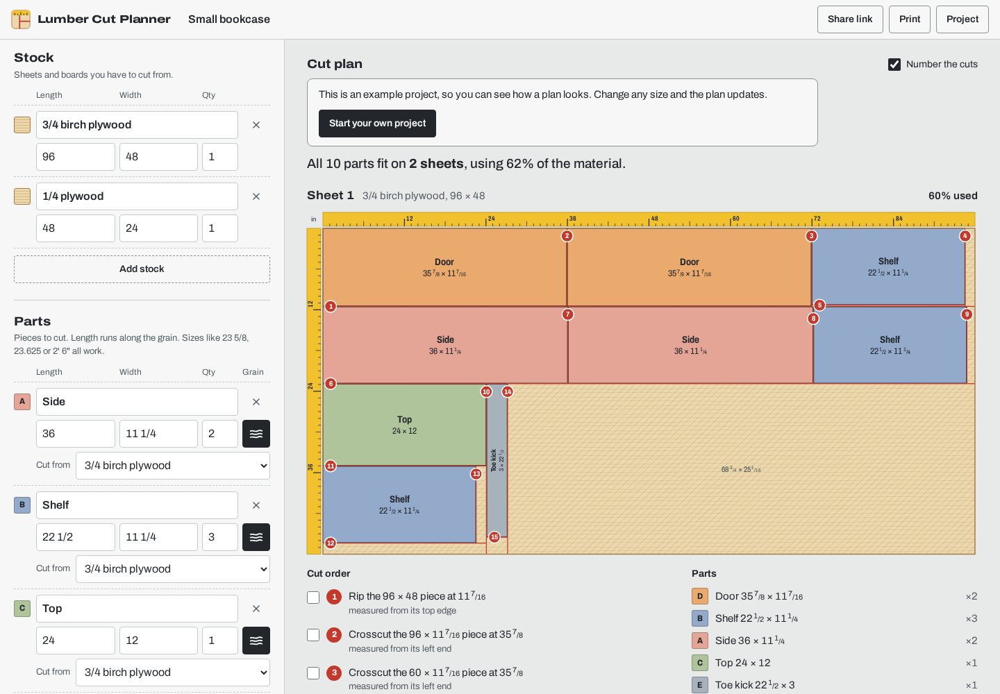

# Lumber Cut Planner

Plan how to cut plywood sheets and boards into the parts for a project. Enter the stock you have and the parts you need, and get a cut diagram, a numbered cut order you can tick off at the saw, and a list of offcuts worth keeping.

It runs entirely in your browser. There's no account and no server, and it keeps working offline once it has loaded.



## Features

- **Live layout.** The plan updates as you type.
- **Real saw cuts.** Every cut runs edge to edge (guillotine cuts), so you can follow the plan on a table saw or with a track saw. The blade kerf is taken out between parts.
- **Cut order.** Each sheet gets numbered rip and crosscut steps with checkboxes. Ticked cuts are remembered.
- **Grain direction.** Lock a part so its length stays along the grain, or let the planner turn it for a better fit.
- **Mixed materials.** List several kinds of stock and choose which one each part is cut from, like ¾" plywood for the carcass and ¼" for the back.
- **Help when it doesn't fit.** Parts that don't fit are listed with the reason, and the app tells you how many more sheets to buy. Adding them takes one click.
- **Sizes the way woodworkers write them.** Type `23 5/8`, `23-5/8`, `23.625`, `2' 6"` or `600mm`. Switch between inches and millimetres at any time.
- **Save and share.** Projects save automatically in your browser. You can also save a project to a file, open one, or share a link that contains the whole project.
- **Print.** Get one page per sheet, with the diagram and a paper checklist.
- **Works on phones.** The layout is touch-friendly and can be added to your home screen.

## Use it

Once GitHub Pages is enabled (see below), the app is live at
`https://jameskbb.github.io/lumber-cut-planner/`.

To run it locally you need [Node.js](https://nodejs.org) 20 or newer. It has no dependencies, so nothing needs installing:

```bash
git clone https://github.com/jameskbb/lumber-cut-planner.git
cd lumber-cut-planner
npm start
```

Then open http://localhost:8000. A local server is needed because browsers won't load JavaScript modules from `file://`.

## Deploy to GitHub Pages

1. In the repository, open **Settings → Pages**.
2. Under **Build and deployment**, choose **Deploy from a branch**, pick `main` and `/ (root)`, and save.

There's no build step. The files in the repository are the site.

## Develop

```bash
npm test
```

The tests use Node's built-in test runner. They cover size parsing and formatting, project validation and share links. They also check that random projects always produce plans that can actually be built: parts inside the sheet, at least a kerf apart, grain respected, and no saw cut passing through a part.

| Path | What it does |
| --- | --- |
| `src/planner.js` | The cut planner. Pure functions with no browser code, so it can be reused in a native app. |
| `src/units.js` | Parses and formats lengths (fractions, feet and inches, metric). |
| `src/store.js` | Project defaults, validation of files and links, share-link encoding. |
| `src/sheet-view.js` | Draws a sheet as SVG. |
| `src/app.js` | The interface. |
| `sw.js`, `manifest.webmanifest` | Offline support and home-screen install. |

## Privacy

Projects are stored only in your browser's local storage. A share link carries the project inside the link itself, after the `#`, which browsers don't send to the server.

## Legacy version

The original Python and Matplotlib script is in [`legacy/`](legacy/) for reference. The web app replaces it.

## Credits

The interface uses [Archivo](https://github.com/Omnibus-Type/Archivo) by Omnibus-Type, licensed under the SIL Open Font License ([`fonts/OFL.txt`](fonts/OFL.txt)).
