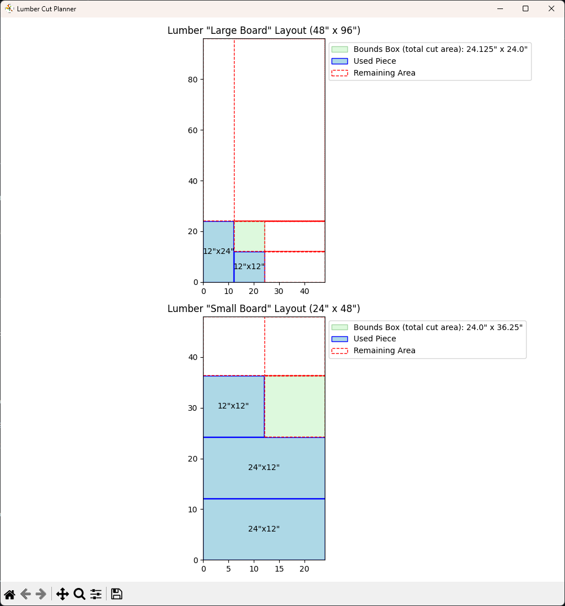

# Lumber Cut Planner

A Python-based tool to optimize and visualize lumber cuts for woodworking projects, minimizing waste and efficiently using available material.

---

## Features

* **Cut Optimization:**

  * Intelligently arranges your pieces to maximize material use and minimize waste.
  * Prioritizes tight bounding boxes and reuses existing board spaces effectively.

* **Visualization:**

  * Provides clear, graphical representations of cut plans.
  * Easy-to-understand visual guides using Matplotlib.

* **Customizable Parameters:**

  * Blade kerf width (default: 0.125 inches).
  * Board dimensions and quantities.

* **Interactive Mode:**

  * User-friendly prompts to enter available lumber and desired piece specifications.

* **Demo Mode:**

  * Predefined example demonstrating the tool's capabilities immediately.

---

## Installation

Clone the repository:

```bash
git clone https://github.com/jameskbb/lumber-cut-planner.git
cd lumber-cut-planner
```

Install dependencies:

```bash
pip install matplotlib
```

---

## Usage

Run the demo:

```bash
python lumber_cut_planner.py
```

Switch to interactive mode by changing the mode in `lumber_cut_planner.py`:

```python
mode = "interactive"  # switch from 'demo' to 'interactive'
```

Then run:

```bash
python lumber_cut_planner.py
```

Follow the on-screen instructions to enter your available lumber and desired final piece sizes.

---

## Example Output

The script generates detailed visual layouts like the following:



---

Enjoy your woodworking project planning! 🪚🪵
